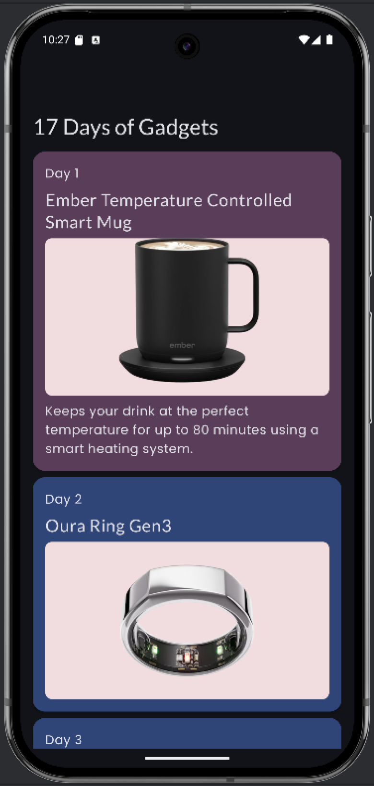

# Google Android with Compose

This repository contains my progress and projects completed as part of the [Google Android with Compose](https://developer.android.com/courses/android-basics-compose/course) course.

## Overview

This is a self-paced, online course designed to teach the fundamentals of building Android apps using modern best practices. The primary focus is on using *Jetpack Compose*, the recommended toolkit for building native user interfaces in Android.

### Methodologies and Libraries Used

*   **Programming Language**: Kotlin
*   **UI Toolkit**: Jetpack Compose
*   **Design System**: Material Design 3
*   **App Architecture**: Modern Android Development (MAD)
    - **UI Layer**: Jetpack Compose + ViewModel with Unidirectional Data Flow (UDF)
    - **Data Layer**: Repository pattern with single source
*   **State Management**: `UiState`, `ViewModel`, `StateFlow`, `mutableStateOf`, `remember`
*   **Navigation**: Jetpack Navigation Component (Compose integration)
*   **Networking**: Retrofit
*   **Image Loading**: Coil
*   **Asynchronous Programming**: Kotlin Coroutines, Flows
*   **Data Persistence**:
    *   Room (SQLite abstraction)
    *   Preferences DataStore
*   **Dependency Injection**: Manual DI with a container, Hilt
*   **Background Tasks**: WorkManager
*   **Testing**:
    *   Unit Tests: JUnit, Truth, Turbine (Flow testing)
    *   UI Tests: Compose Testing, Espresso (View/Compose screens)
*   **Interoperability**: `ComposeView`, `AndroidView`, integrating Compose into Views and Views into Compose

## Each Unit Learning with Apps Screenshots

*   **Unit 1:** Covers Kotlin programming fundamentals, Android Studio setup, and building a basic Android app with a simple Jetpack Compose UI that displays text and images.\
**Apps Name:** HappyBirthday, ComposeQuadrant, ComposeArticle, BusinessCard

  
  
  
  

*   **Unit 2:** Dives into Kotlin fundamentals (conditionals, functions, classes, and *lambdas*) and explores building interactive UIs with *Jetpack Compose*, handling user input, managing state, and writing unit tests.\
**Apps Name:** Lemonade, DiceRoller, TipCalculator, ArtSpace

  
  
  
  

*   **Unit 3:** Focuses on displaying scrollable lists, applying *Material Design* principles (*Theme*, *Color*, *Shape*, and *Typography*) to create modern user interfaces, while expanding Kotlin skills with data classes, collections, and interactive list items.\
**Apps Name:** Courses, Woof, SuperHeroes, 17DaysOfGadgets

  
  
  
  
   
  
  
  
  

*   **Unit 4:** Covers modern Android architecture (*ViewModel*, *StateFlow*, and the *Unidirectional Data Flow* pattern), navigation with Jetpack Compose, and responsive UIs using window size classes optimized for phones, tablets, and *foldables*, as well as *navigation drawers* and other adaptive design best practices.\
**Apps Name:** DessertClicker, Unscramble, Cupcake, LunchTray, Sport, Reply, ParisTour

  
  
  
  
   
  
  
  
  
   
  
  
  
  
   
  
  
   
  
  
  
   
  
  
  
  

*   **Unit 5:** Introduces networking in Android apps, using Kotlin *Coroutines* for concurrency, *Retrofit* to fetch data from REST APIs, *Coil* to load and display images, and *Dependency Injection* to build a clean, testable data layer with a repository pattern.\
**Apps Name:** RaceTracker, MarsPhotos, Amphibians, BookShelf

  
  
  
  

*   **Unit 6:** Covers local data persistence in Android, using *Room* with SQLite for structured data, *Preferences DataStore* for key-value storage, and Database Inspector for debugging, ensuring apps remain functional offline, with *Hilt* Library used for clean and testable dependency injection in the data layer.\
**Apps Name:** DessertRelease, BusSchedule, Inverntory, FlightSearch

  
  
  
   
  
  
  
  
   
  
  
  

*   **Unit 7:** Introduces *WorkManager* for scheduling reliable background tasks such as data syncs or backups that persist even when the app is closed or the device restarts, with debugging support via the *Background Task Inspector*.\
**Apps Name:** BlurOMatic, WaterMe

  
  
  
  

*   **Unit 8:** Covers *interoperability* between Jetpack Compose and the traditional View-based UI toolkit, enabling seamless integration of composables into View-based apps using *ComposeView* and embedding Views within Compose using *AndroidView*, along with navigation between fragments and reuse of existing View-based components.\
**Apps Name:** JuiceTracker Compose (embed Views) , JuiceTracker Views (embed Compose) 

  
  
  
  

